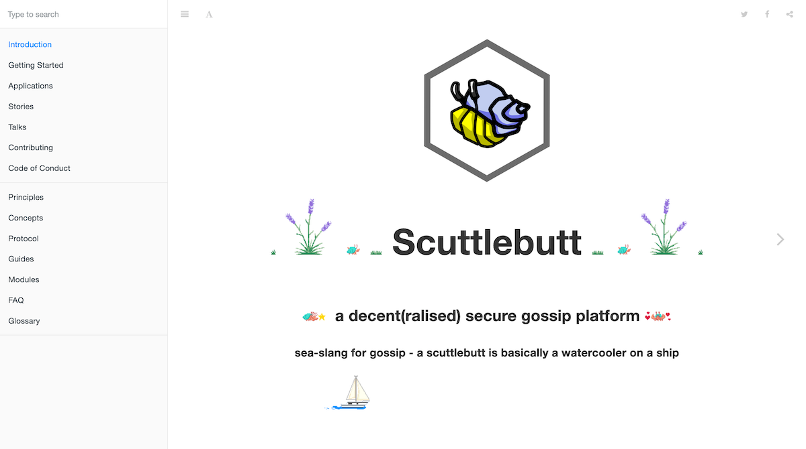
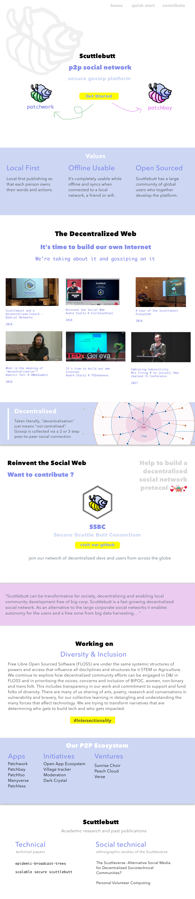
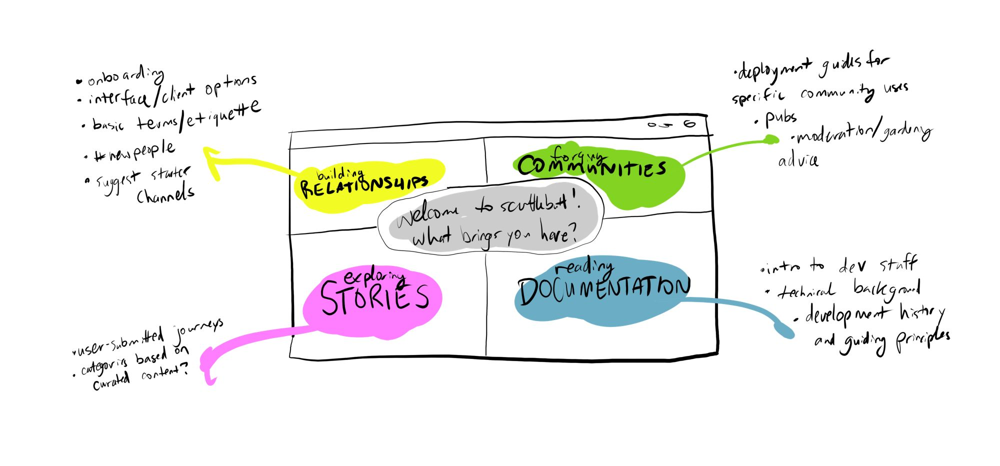

# ssb-website-2.0

> with accessibility, inclusivity, and diversity in mind.

### update

The repo for development is here ==> https://gitlab.com/marylychee/ssb-website-2.0
Votes within scuttle butters decided upon diversifying our git repository responsibilities in light of being aware of tech monopolies and such, especially after watching [The economics of open source by C J Silverio](https://www.youtube.com/watch?v=MO8hZlgK5zc).

I encourage you to follow the thread on scuttlebutt here `%90cpJesddE8aullfGxLR70nCRWE7i2F1gkuwZNujRnc=.sha256`.

Mostly the gist is:

- our target for launching the new site is JULY 11TH 2019
- do lil patches of code and design contributions, designs below as guides
- organisation of different working bee groups/pair programming will be posted on gitlab. Go there! 

### context

We're refreshing the look and language of [ssb.nz](ssb.nz) from a developer-centric layout and language with git-books, to a more engaging and user friendly site. We've kind of known the current main face of scuttle butt has been put offish for non-developers and hard to navigate for new interested folks for awhile. Though once you're on it, it's fun and fairly intuitive. The new site should reflect that!

There is the post in ssb for context here: `%90cpJesddE8aullfGxLR70nCRWE7i2F1gkuwZNujRnc=.sha256`

### Current design draft

> [figma link](https://www.figma.com/file/cncbZdFKTpOEbKYGPjkTczVc/scuttlebutt)

# Contributions

> decentralised and diversified

Currently we've just started to invite opinions, co-design, and development from within SSB. I'm taking the responsibility for handling the funds reserved for this website and will be accountable to the community and the Handshake Council. Funds will be handled through [ACCESS Collective](https://opencollective.com/access).

My aim is to also document this process to be inclusive and invite diversity as an active process in itself.

Right now, I'm just working with Endo at the moment on drafts and ideas, though there's a gush of support beginning to pick up on SSB, blowing wind in our sails.

It's been suggested that we next hold a meeting with those who've previous expressed that they wanted to help, decide how to share responsibilities, and the process that will be used to allocate money.

My current ideas is to make each section modular for people to a contribute in, either asynchronously or via pair design and pair program.

> I want to invite diversity and representation in design, research links, and development, and to enable invite small incremental patches that include opinions, concerns and compassion, from the wider (not just dev-centric) network.

I also acknowledge that there may be SSB users from outside my personal SSB gossip network that might want a say and to work together that's why I'm making this github link. Since SSB is decentralised in nature, crafting a website that represents this project/platform, shall be a creative challenge.   

I hope to try experiment in open collaboration and active listening. SSB has a special place in my heart and I hope to be able to be active in it's growth and transformation.

and yes I know this ain't the usual Read me. ✌️☮️🕊
